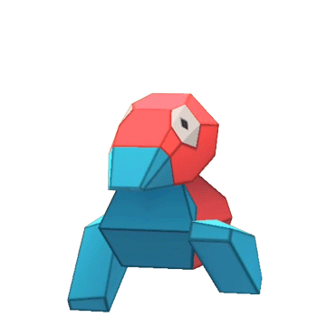
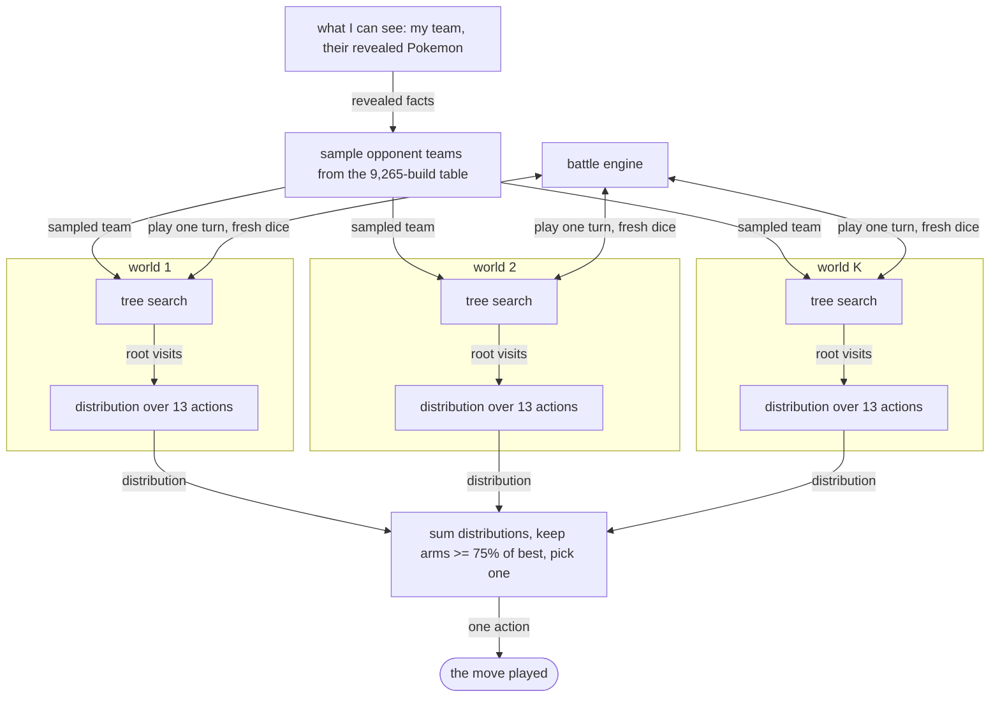

# Plygon

A Generation 9 Pokemon battle engine written from scratch in Rust, and a Monte Carlo tree search agent that plays it.

 

<p align="center">
  
</p>

The engine simulates a complete six-on-six battle in about **13.9 microseconds**, roughly [72,000 battles per second](docs/benchmarks.md) on one core. The whole battle state is **664 bytes** and copies with a single `memcpy`. Correctness is checked by [running it against Pokemon Showdown](docs/conformance.md) on randomly generated battles and diffing the results field by field.

Playing on the real Pokemon Showdown Gen 9 Random Battle ladder, the bot peaked at around 2133 Elo, sustaining roughly 82% GXE over a few hundred battles.

## Why I built it

I wanted to write a Pokemon AI, and a search algorithm needs to play out millions of hypothetical battles to pick one move. Pokemon Showdown is the reference implementation of the rules, but it is a game server. It allocates, it builds strings, it emits a protocol log. That is the right design for running matches between people and the wrong one for use as the inner loop of a search.

So I wrote an engine whose only job is to be fast and correct, and then wrote the search on top of it.

## Quick start

```bash
git clone https://github.com/Eucalyptus5/Plygon && cd Plygon
cargo build --release
cargo test --workspace                                   # 1,448 tests
cargo run --release --bin selfplay -- \
    --p1 mcts --p2 random --games 20 --max-iters 4096
```

The last command plays 20 games of the search agent against a random player and prints the result.

## How it works



**The engine** keeps the entire battle in one flat block of memory with no pointers and no heap allocation, so copying a position is a single memory copy. All damage arithmetic is integers on a fixed scale, matching Showdown's numbers and also the exact points at which it rounds, because a one-HP difference can decide whether a Pokemon faints. The data tables for 876 moves, 1,454 species forms and 484 items are generated at build time from Showdown's own data files rather than parsed at runtime. The engine contains no random number generator at all; callers pass one in, which is what makes deterministic replay and side-by-side testing possible.

[Read more about the engine](docs/engine.md)

**The search** cannot see the opponent's team, so it guesses. It samples complete possible opponent teams from a distribution built by generating 100,000 real teams with Showdown's own generator, searches each guess in parallel, and combines the results. Because both players move simultaneously, each node in the tree keeps separate statistics for each player rather than assuming someone is "to move". As the opponent reveals moves and takes damage, a belief tracker narrows the guesses, including by running the real damage calculator backwards to rule out builds that could not have dealt the damage you just took.

[Read more about the search](docs/search.md)

**The evaluator** shipped here counts survivors and HP. The repository also carries the inference code for a learned one: a sparse embedding of the position summed per side, a 6 by 6 web of cross-side matchups, and a policy head that seeds the root. Its weights are not included.

[Read more about the evaluator](docs/evaluator.md)

## Is it correct?

This is the part I spent the most time on, because Pokemon has thousands of interacting rules and most of the hard ones are undocumented.

I run my engine and a real Showdown installation on the same randomly generated battles and compare the results. The difficulty is that Pokemon is full of dice, so the two would disagree constantly for uninteresting reasons. Instead, every random decision in both simulators is pinned to the same forced outcome: damage rolls, critical hits, accuracy, secondary effects, speed ties, paralysis, thawing. Then the resulting battle states are compared field by field, every turn, for every Pokemon.

Any disagreement is automatically shrunk to the smallest battle that still reproduces it. A coverage check halts the run if any part of the game state stops being exercised, because a fuzzer that quietly stops testing something looks exactly like a fuzzer that is passing.

This turned up around 250 genuine differences from Showdown. 186 have a recorded fix and roughly 96 remain open. One representative example: critical hits were rolled once before a multi-hit move instead of once per hit, so a two-hit move was always all-crits or no-crits. The average was correct, which is why deterministic testing never caught it. It only showed up in a test of the distribution's shape.

[Read more about the testing rig](docs/conformance.md)

## Some things I found

I spent a long time trying to make the agent stronger, and the useful results were mostly negative.

**Searching harder does not help.** Win rate is flat across a 64-fold increase in search budget. The search only looks about 3 moves ahead against roughly 25 to 30 plausible actions per turn, so a tenfold speedup buys about six tenths of one extra turn of foresight in a game that lasts 27 turns. Worse, on positions with a known correct answer, the search gets measurably *further* from it as the budget grows.

**Hidden information matters less than it looks.** Each turn rules out 60 to 70 percent of the remaining possibilities, because Pokemon reveals itself as it is played. An agent simply handed the opponent's real team gains only about nine percentage points.

**A theoretically correct fix can still lose.** The search was leaking the agent's own hidden information to the simulated opponent, so it never valued deception. Fixing that is obviously right, and the fixed version lost decisively across two independent runs on four machines. It is implemented, off by default, and documented rather than deleted.

## Scope

Generation 9 singles only. Terastallization, Paradox abilities and current items are implemented. Doubles, Z-moves, Dynamax, team preview and team legality checking are not.

The evaluation function included here scores a position by surviving Pokemon and remaining HP, and is **deliberately untuned**. It exists so the search runs out of the box. Evaluators sit behind a one-method trait, and replacing it is the intended way to make the agent play well. My tuned evaluator and its trained weights are not part of this release.

## Why you might not want this

If you want to actually play Pokemon, use [Pokemon Showdown](https://github.com/smogon/pokemon-showdown). This is a search substrate, not a game.

If you need every format, use Showdown too. This engine does singles and nothing else.

If you need a guarantee of exact agreement with Showdown, this is not it. The testing rig compares battle state rather than everything, and about 96 known differences are still open. It is closely checked, not proven.

If you want a strong bot out of the box, the shipped evaluator will not give you one.

## Repository layout

| Path | What it is |
|---|---|
| [`pkmn-engine/`](pkmn-engine) | The battle engine |
| [`pkmn-engine/codegen.py`](pkmn-engine/codegen.py) | Generates the data tables from Showdown's files |
| [`pkmn-engine/conformance/`](pkmn-engine/conformance) | Differential testing rig and fuzzer |
| [`poke_mcts/`](poke_mcts) | The search agent |
| [`docs/`](docs) | [engine](docs/engine.md) · [search](docs/search.md) · [evaluator](docs/evaluator.md) · [testing](docs/conformance.md) · [benchmarks](docs/benchmarks.md) |

## License

GPL-3.0. See [LICENSE](LICENSE).

Data files under `pkmn-engine/src/showdown_data/` are derived from Pokemon Showdown and used under the MIT license. See [NOTICE](pkmn-engine/NOTICE).
