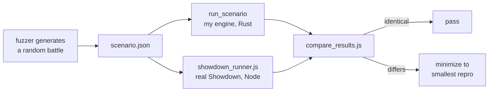

# Testing against Pokemon Showdown

Writing a battle engine is easy. Writing one that agrees with the real game is not. Pokemon has thousands of interacting rules, and most of the hard ones are undocumented edge cases that only show up in specific matchups.

So I did not try to get it right by reading. I built a rig that runs my engine and [Pokemon Showdown](https://github.com/smogon/pokemon-showdown) side by side on the same randomly generated battles and reports every disagreement.

## How it works



A **scenario** is a JSON file describing both teams, any starting conditions, and a list of turns with the action each side takes. It is fed to two runners on standard input: a small Rust binary that drives my engine, and a Node script that drives a real Showdown battle. Both print the resulting battle state in the same format, and a comparison script diffs them field by field.

## The hard part: making the comparison mean something

Pokemon is full of dice. Damage varies by up to 15 percent, moves miss, critical hits happen, secondary effects proc, and speed ties are coin flips. If the two simulators roll independently, they will disagree constantly for reasons that have nothing to do with correctness.

The two simulators do not share a random number generator. Instead, **every random decision in both is pinned to the same forced outcome.**

My engine makes this straightforward, because it has no random number generator of its own. Every entry point takes a closure, and the `max` argument identifies what is being rolled: 16 is a damage roll, 24 is a critical hit, 100 is accuracy or a secondary effect, 2 is a speed tie, 4 is full paralysis, 5 is thawing. The test harness supplies a closure that returns a fixed answer for each.

Showdown needs more work. The harness patches the battle object's `randomChance`, `random`, `sample`, and damage randomizer so each one returns the matching fixed answer. One detail that matters: the patch intercepts `sample` rather than the underlying generator, so Showdown's speed-tie shuffle is left alone.

The two simulators also number their damage rolls in opposite directions, so the harness converts explicitly: my roll `r` is Showdown's `15 - r`.

Six modes are available: force everything to the maximum, force nothing, minimum roll, maximum roll, **all 16 rolls**, or a specific hand-picked set. Damage is never compared on a single roll. It is always compared across all sixteen, because two engines can agree on the average and still disagree on the distribution.

One honest caveat: my engine distinguishes an accuracy check from a secondary-effect check by the order they are drawn, while the Showdown patch distinguishes them by a threshold on the probability. These agree for ordinary moves but are not literally the same rule.

## The fuzzer

The generator builds a battle from a 32-bit seed. It picks one to six Pokemon per side, draws an ability from that species' real ability list, a legal item, and four moves sampled from that species' actual Generation 9 learnset. It randomizes EVs (capped at the legal 510 total), nature, level, Tera type, and gender. Turn one's actions come from asking the engine what is legal; each later turn is appended the same way. Battles run up to eight turns.

Ninety percent of scenarios force every roll to a fixed value; the other ten percent test one turn across all sixteen damage rolls.

Findings are sorted into four buckets. **Bugs** are genuine disagreements. **Rejected** means Showdown refused the move as illegal, which is a harness artifact rather than an engine defect. **Suppressed** means every piece involved is already on the known-issues list. **Splash** means a coverage check tripped.

Every disagreement is then **minimized**: the tool shortens the battle, drops unused bench Pokemon, replaces moves with Splash, and strips items, keeping a change only if the disagreement still reproduces in the same way. What lands in the report is the smallest battle that still shows the bug.

## The coverage gate

A fuzzer that silently stops exercising part of the engine is worse than no fuzzer, because the clean results look like progress.

So the run tracks 26 categories of game state and halts if any one of them goes unexamined for 1,000 consecutive scenarios. A separate check halts the run if engine errors or crashes exceed 0.1 percent.

## What is compared, and what is not

This matters for reading any claim about fidelity honestly.

**Compared,** every turn, for both sides: each Pokemon's HP, status, fainted flag, item, and ability; the active Pokemon's seven stat boosts, substitute HP, and confusion, taunt and encore counters; whether it has Terastallized, and its effective types, ability, item, and species; entry hazard layers; whether each screen is up; weather; terrain; and the number of turns that elapsed.

**Not compared:** the battle log, PP, the full volatile-status list, raw stat values, move order, per-hit damage breakdown, and the winner.

That last one surprises people. The winner is recorded as metadata but does not decide pass or fail, because the state comparison is strictly stronger. Two engines that agree on every Pokemon's HP and status every turn have already agreed on who wins.

## Static data

Dynamics are only half the problem. The other half is whether my tables say a move has 80 base power when Showdown says 90.

A separate tool dumps every move, species, and item from my engine and diffs it against Showdown's own data. Move comparison covers about ten fields plus a flag mapping, and flags cases where Showdown has behaviour attached that my engine models as nothing. Species comparison covers base stats, both types, and weight.

Items are only *counted*, not compared field by field. I would not claim items are validated by this tool.

## What I am willing to claim

The engine is differentially fuzzed against a real Showdown checkout on randomly generated Generation 9 battles, with every random decision pinned to the same outcome on both sides, and the resulting battle states compared field by field. Disagreements are automatically reduced to a minimal reproduction, and a coverage gate stops the run if any part of the state space goes untested.

What I would **not** claim: that the engine is bit-exact with Showdown (several things are never compared), any single headline agreement percentage (this rig does not produce one), or that every known difference is fixed. The suppression file currently carries 243 tracked divergence identifiers across roughly 1,650 game pieces, and around 96 issues remain open.

## Running it yourself

Everything needed is in this repository except Showdown itself, which you have to supply:

```bash
git clone https://github.com/smogon/pokemon-showdown ../pokemon-showdown
cd ../pokemon-showdown && npm install && node build
```

The harness finds it via the `SHOWDOWN_DIR` environment variable, a config entry, or a sibling directory. You will need Node 16 or newer and a Rust toolchain. The fuzzer itself has zero npm dependencies.

Two things are deliberately absent from a fresh clone. The finding archive and corpus are ignored by git, so you start with an empty inbox. And the script that regenerates the suppression file from my private issue ledger is not published, so you would maintain that file yourself.
