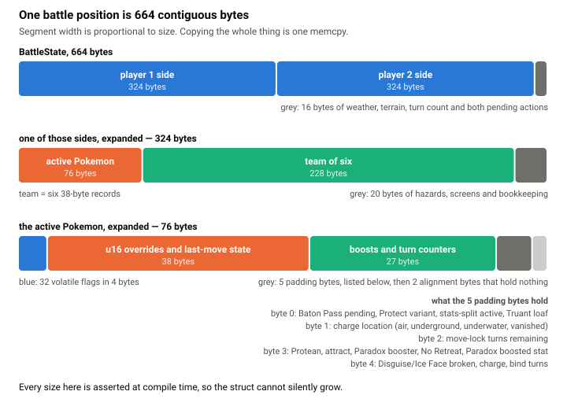
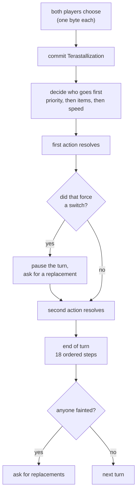

# How the battle engine works

The engine has one job: play out a Pokemon battle as fast as possible, exactly the way the real game does. Everything below follows from those two goals pulling against each other.

## The battle state is one flat block of memory

A search algorithm copies the game state constantly. Copying is the inner loop. So the state is built to be cheap to copy and nothing else.

`BattleState` is **664 bytes**, has a fixed C layout, contains no pointers, and implements `Copy`. Copying one is a single `memcpy` of one contiguous block. There is nothing to allocate, nothing to reference-count, and nothing to clean up afterwards.

<picture>
  <source media="(prefers-color-scheme: dark)" srcset="img/state-layout-dark.svg">
  
</picture>

It breaks down like this:

| Piece | Bytes | What it holds |
|---|---|---|
| `MonSlot` | 38 | One Pokemon's lasting identity: species, ability, item, HP, stats, moves, PP, status |
| `ActiveMon` | 76 | Everything true only while a Pokemon is out, wiped on switch |
| `SideConditions` | 16 | Entry hazards, screens, Wish, Future Sight |
| `FieldState` | 10 | Turn count, weather, terrain, Trick Room, Gravity |
| `SideState` | 324 | One active Pokemon plus a team of six plus conditions |
| `BattleState` | 664 | Two sides, the field, the phase, and both pending actions |

These sizes are not aspirational. They are checked at compile time, so the code will not build if a field pushes a struct over its budget. There is also a compile-time proof that `BattleState` really is `Copy`, which means the memcpy property cannot be lost by accident.

Data that never changes during a battle, like IVs, EVs, and natures, lives in a separate structure passed by reference. There is no reason to copy it millions of times.

### Bits, and the padding problem

Temporary conditions (is there a Substitute up, is this Pokemon charging, is it locked into a move) are a single 32-bit integer with 32 named flags. Clearing everything that expires at end of turn is one bitwise AND rather than 32 assignments.

The more unusual decision is what happens to padding. Aligning these structs leaves a few unused bytes, and rather than let them sit empty I put real information in them. One side's padding byte carries seven separate booleans. Future Sight packs its move, countdown, and damage type into a single byte. The mid-turn resume marker described below lives in leftover space across two structs.

This is the kind of thing that needs justifying rather than admiring. The justification is that every byte added to `BattleState` is a byte copied on every node of every search, and I would rather spend a bit-shift than a wider memcpy. The cost is that these fields are reached through named accessor functions instead of being plain struct members, and that is a real readability tax.

## One turn, start to finish

Both players choose at the same time, so the engine takes both decisions at once and returns when it needs something new from a player.

An action is a single byte. Zero through three is a move slot, four through nine is a switch to a team position, ten through thirteen is "Terastallize and then use this move," and 255 is Struggle.

A turn runs in this order:




1. **Commit Terastallization** before anything else resolves, because it changes defensive typing even if the other player moves first.
2. **Decide who goes first.** Move priority first, then the various priority-modifying abilities, then Quick Claw and its relatives, then speed, with Trick Room inverting the comparison and a coin flip breaking exact ties.
3. **Publish both decisions** into the state, so moves like Sucker Punch and Protect can legally ask what the opponent chose.
4. **Execute** the first action, check whether either side has been wiped out, then the second.
5. **Run end of turn**, an explicit sequence of 18 ordered steps covering weather, status damage, item triggers, and everything else that ticks.
6. **Handle faints**, and either end the battle or ask the affected player for a replacement.

### Pausing in the middle of a turn

The genuinely awkward case is a move like U-turn, or an Eject Button, which forces a switch *before* the slower Pokemon has acted. The turn has to stop, ask a player for a decision, and then resume exactly where it left off with the second half still pending.

Rather than restructure the engine around coroutines or an action queue, I store a small resume marker in those spare padding bytes: which sub-phase we stopped at, which side still owes an action, and what that action was. The engine returns, the caller supplies a replacement Pokemon, and the follow-up entry point picks the turn back up and finishes it.

It is a compact solution to a problem that otherwise infects every function signature in the call stack.

## Damage is integer arithmetic, on purpose

Every damage modifier is an integer on a 4096 scale, and combining them goes through one function:

```rust
#[inline(always)]
pub fn chain_mod(value: u32, num: u32) -> u32 {
    if num == 4096 { return value; }
    (value * num + 2047) >> 12
}
```

So 1.5x is 6144, 1.25x is 5120, 0.5x is 2048. The `+ 2047` rounds half upward and the `>> 12` divides by 4096. The early return for 4096 matters because "no modifier" is by far the most common case.

There are no floating-point numbers anywhere in the damage path. That is not only for speed. Pokemon truncates to an integer at specific points, and **which** points is part of the rules. Getting a damage number correct to within one HP is still a bug, because one HP can be the difference between a Pokemon fainting and surviving to use a berry. In one case I fixed, a rounding difference of a single HP changed whether a berry triggered, which changed the healing, which changed the rest of the battle.

The same reasoning drives some odd-looking choices elsewhere. Thick Fat is implemented as a change to the attacking stat rather than as a halving of damage, because that is where Showdown applies it, and applying it in the other place truncates differently.

### What runs once versus per hit

A multi-hit move can hit ten times, so everything that does not change between hits is computed before the loop: the level factor, weather, same-type bonus, burn, screens, ability and item modifiers, and the critical-hit multiplier. The attack and defence stat chains are each computed in two versions, normal and critical, with the critical version reusing the normal value whenever a critical hit could not change it.

Inside the per-hit loop there is only an accuracy roll, a critical-hit roll, the base formula, and the modifier chain applied in Showdown's exact order: weather, critical hit, the random 85-to-100 roll, same-type bonus, type effectiveness, burn, screens, defender ability, attacker ability, item, then a floor of one damage.

## Move execution is mostly a table

The file that executes moves is about 11,000 lines, which sounds unmanageable until you see the split. Of 921 move slots, only **230** need any bespoke code. The rest are fully described by a 16-byte record: base power, accuracy, type, category, priority, PP, a bitfield of flags like "makes contact" or "is blocked by Protect," and a small enum naming its effect.

So dispatch is layered. Most moves fall out of the generic damage path. Moves with a shared effect pattern go through one match on that effect. A handful of genuinely unique moves are matched on their ID directly, deliberately placed where the comparison is false for every other move. Sets of moves, like everything Metronome can call, are sorted arrays searched by binary search.

## The data tables are generated

I do not parse anything at runtime. A Python script reads Showdown's own TypeScript data files, which are vendored in this repository under an MIT notice, and emits Rust source: 921 move records, 1,454 species entries covering base forms and alternate forms, 762 item slots, and several sorted lookup tables.

The result compiles into read-only static memory and is indexed directly. Runtime parsing would mean JSON, heap allocation, and hashing on a path that runs millions of times a second.

The mapping from a move to its effect is hand-written in that script. That is where the actual game knowledge lives; the generator only fills in the surrounding structure.

## The engine has no random number generator

Every function that needs a die roll takes a closure supplied by the caller, returning a value below a given bound.

This one decision makes several things possible at once. The search can drive the engine with its own seeded generator and replay a search exactly. The conformance harness can force every roll to a specific value and compare against Showdown deterministically. And two runs on different machines can be compared bit for bit.

There is one deliberate exception. The end-of-turn path, which is comparatively cold, takes the closure as a dynamic reference so it compiles once instead of once per caller. The hot damage path keeps the generic form so it stays inlined. The comment above it says not to make these consistent.

## Other things done for speed

- No heap allocation anywhere in the battle path. The legal-action list is a fixed 13-byte array on the stack.
- `#[inline(always)]` on small hot functions, about 124 of them.
- The four hottest tables are indexed without bounds checks, guarded by debug assertions.
- Shifts instead of divides. Quick Claw's HP check multiplies by four rather than dividing.
- Lookup tables instead of branches for stat stages, accuracy stages, multi-hit counts, and the full type chart.
- Cold checks placed after hot ones so the common path stays short.
- Whole-program link-time optimization in the release profile.

## Scope

This is **Generation 9 singles**. Terastallization, Paradox abilities, and the current item set are all implemented. Roughly 876 real moves, 1,026 base species plus 354 alternate forms, 484 items, and around 250 abilities.

Not implemented: doubles or any multi-battle format, Z-moves, Dynamax, team preview, and team legality checking. The engine plays whatever teams you hand it.

Known gaps are marked in the source rather than hidden, and tracked in the [conformance rig](conformance.md).
