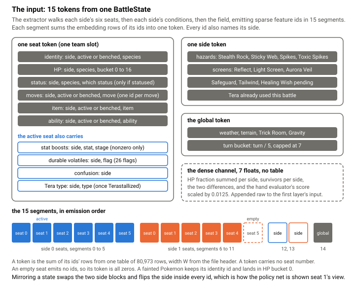

# How the learned evaluator works

The evaluator that ships here counts survivors and HP. Next to it, `poke_mcts` carries the inference code for a small neural network that scores a position, and a second one that suggests moves at the root. Their trained weights are not included.

## Where it plugs in

Both networks implement the same one-line `Evaluator` trait as the hand evaluator, and the driver's `EvalKind` enum names which one a decision uses. The value network returns a number in the hand evaluator's units, so the root-relative squash from the [search page](search.md) applies unchanged.

The policy network returns 14 logits, one per action byte. Illegal bytes are masked, a softmax makes a prior, and the prior reaches one place only: the root bandit of the side making the decision, where the score becomes `q + P[a] · √N / (1 + n)`. A prior on the opponent's bandit would model them as choosing by our policy, and one at every node would tax every node instead of every turn.

## The input

<picture>
  <source media="(prefers-color-scheme: dark)" srcset="img/eval-tokens-dark.svg">
  
</picture>

An extractor turns a `BattleState` into around a hundred sparse feature ids from a vocabulary of 80,973. Each id is a conjunction, such as (side, active or benched, species) or (side, species, one of 17 HP buckets), because the sum that follows keeps nothing but what is in the key: if half health means something different on different Pokemon, the key is where that has to be said.

The ids come out in 15 segments, one per seat, per side and for the field. An empty seat becomes an all-zero token. Segments exist because two benched Pokemon that know the same move emit the same id, so which Pokemon emitted it is not recoverable from the id.

Seven dense floats bypass the table: HP and survivor totals per side, their differences, and the hand evaluator's own score. The first networks lost to a plain material count until this channel existed. With the hand score as an input, the network only has to learn what the hand evaluator gets wrong.

## The forward pass

<picture>
  <source media="(prefers-color-scheme: dark)" srcset="img/eval-forward-dark.svg">
  
</picture>

Each segment sums its ids' rows from one embedding table, giving 15 tokens of width W. Each side's tokens are added into an accumulator and rectified: a gather and an add over a hundred rows, cheap enough to run at every leaf.

Pooling a side into one vector loses which of my Pokemon threatens which of theirs, and that grid decides switching. So the web projects my six tokens with one matrix and theirs with another, multiplies the pairs elementwise, and rectifies each of the 36 cells. Their sum and the active pair's cell join the accumulators and the dense floats in an input of 2W + 2R + 7, R being the web's rank, then fully-connected layers with ReLU between them and one output. The ReLU in each cell is what matters: without it the 36 products sum to one product of two pooled sides.

The policy network shares this trunk. Its switch head runs once per seat and reads that seat's token and web row; its move head runs once per move, and again with Terastallization applied, and reads the active seat plus a learned move embedding, because a token sums the move set and cannot say which slot is which. Every head evaluation also gets eight floats from `action_features.rs`, computed by the engine's own damage calculator: damage, kill, effectiveness, speed order and a few flags. Without them the network had to re-derive the damage formula from examples; with them it made its largest single gain.

<picture>
  <source media="(prefers-color-scheme: dark)" srcset="img/eval-prior-dark.svg">
  
</picture>

The policy loader also accepts a species-pair and type-pair bias in each cell, and both loaders accept one attention head over the tokens. Neither network needs them: the tables wanted more data than they had, and attention costs several times the web while normalizing away how many threats there are.

## Serving

The value forward's scratch is thread-local, so a call allocates nothing. Consecutive leaves share most of their position, so the value forward caches each segment's token and projections keyed on its exact id list, and an unchanged segment costs a key compare. The prior's forward is batched across every sampled world, each row bit-identical to the single forward.

Int8 weights are a per-tensor switch, off by default: every scope measured slower on both ARM and x86, because widening int8 back to float doubles the inner loop's instruction count, and the weights were never the bottleneck.

Every optimization has to compute the identical function, or the results earned before it stop applying. A frozen scalar copy of the forward lives beside the optimized kernels; tests compare the two as raw bits and replay whole searches on stored positions, checking every arm's visits and scores. A cross-machine dump found the network bit-identical on the two machines I compared, while the search around it differed on a few exponentials and logarithms from the platforms' math libraries.

## Why it looks like this

The shape comes from chess engines: an evaluator called inside a search must be a gather and a few small matrix products. Incrementality did not carry over, because a chess network keys everything on a slow-moving king and Pokemon has no slow-moving anything, so full recompute plus the segment cache took its place. The web came from measurement: a learned term for the active matchup alone was the largest single gain in offline runs. Searching deeper with the network did not make it stronger, so the later work went into the root prior rather than the tree.

The weights, corpus and training scripts are not included, deliberately: this is a search substrate, not a bot. The complete inference path is here, with the feature extractors training shared so the two could not drift. The `Evaluator` trait is the extension point for training your own.
