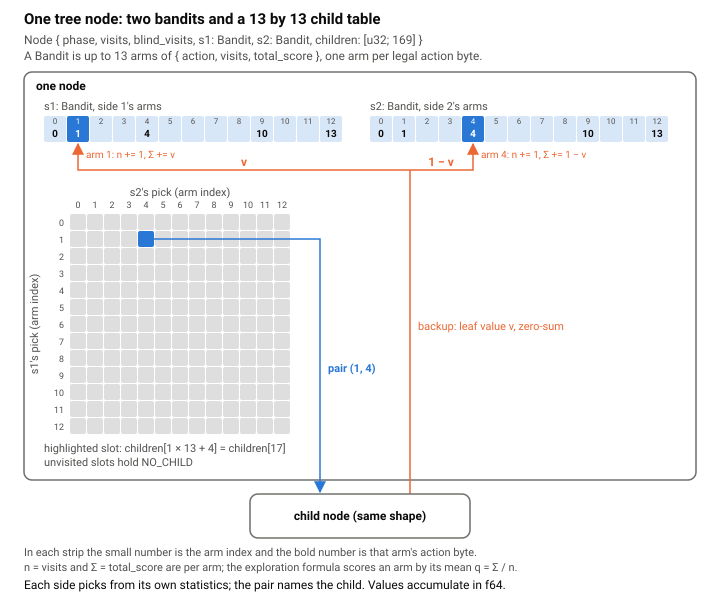
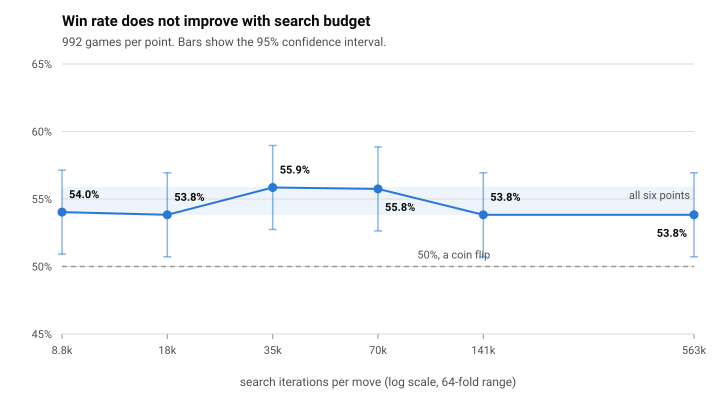

# How the search works

The agent picks a move by playing the rest of the battle out in its head thousands of times and choosing whichever move led somewhere good. That is Monte Carlo tree search, and the standard version of it does not work here. Three things about Pokemon break it.

**You cannot see the other team.** You do not know their Pokemon, their moves, their items, or their held abilities until they show you.

**Both players move at the same time.** There is no "whose turn is it," so a node in the tree cannot own a single list of moves.

**Almost everything is a dice roll.** Damage varies by 15 percent, moves miss, critical hits land, secondary effects proc, and equal speeds are a coin flip.

Each of those gets its own answer.

## Guessing the opponent's team

Since the search needs a complete position to work with and never has one, it invents them. Before searching, it samples a number of complete possible battles consistent with what it has actually seen, searches each one independently, and then combines the results.

The guesses are not arbitrary. The random-battle format draws from a fixed pool of Pokemon builds, and I generated **100,000 real teams** using Showdown's own team generator and tallied what came out: 509 species, 9,266 distinct builds, each weighted by how often it actually appeared. When the search needs to guess, it draws from that distribution.

It then overwrites the guess with everything it genuinely knows: current HP, status, whether they have Terastallized, and how much PP they have spent.

The worlds are searched in parallel, one per core, with each world's seed derived from the master seed. The result does not depend on which world finishes first, and a test pins that.

### Combining the answers

Each world produces a distribution over moves rather than a single best move. The search sums those distributions, keeps every move scoring at least 75 percent of the best, and picks among the survivors.

Taking the single best move from each world and voting would be a mistake, because it quietly assumes the agent will know which world it is in when the time comes. Keeping the distribution keeps the uncertainty.

## Both players moving at once

Every node holds **two** independent bandits, one per player. Each side picks its own move by its own statistics, without conditioning on the other, and the resulting pair of moves names the child node. Each node has a dense table of up to 169 children, one for each combination of 13 possible actions.

<picture>
  <source media="(prefers-color-scheme: dark)" srcset="img/tree-node-dark.svg">
  
</picture>

Selection uses the usual exploration formula:

```
score = average_value + sqrt(explore_coeff * ln(parent_visits) / visits)
```

One warning for anyone porting a value in: **`explore_coeff` is the exploration constant squared**, not the constant itself. The shipped default is 2.0, meaning the textbook square root of two.

Backup is zero-sum. The leaf value goes to one side's chosen arm and one minus that value goes to the other's. Scores accumulate in 64-bit floats, because 32-bit loses precision around 30 million iterations.

## Dice

Three approaches are implemented. The one that runs by default is the simplest: **re-roll the dice every time the search passes through**. Chance is integrated by sampling across thousands of iterations rather than by enumerating outcomes. A tree node represents a pair of chosen moves, not a specific outcome of them.

This is cheap, which is the entire point, but it means the position a node represents drifts between visits. So the search checks, every time it reuses a node, that the current position still matches what that node recorded. When it does not, the iteration stops there and a counter increments. That counter is reported rather than hidden, because it is the honest measure of how much the approximation is costing.

The two alternatives are built and switchable. One adds an explicit layer of chance outcomes under each move pair, widening gradually as a branch gets more visits and merging outcomes that are strategically identical. The other splits only the root, and only for a single-hit move that cannot miss, into an exact "this kills" and "this does not kill" pair weighted by the real probability. Neither is the default, for reasons in the findings section below.

## Tracking what the opponent has shown

The belief tracker holds, per opposing Pokemon, the species, revealed moves and PP spent, item, ability, Tera type, level, a set of things it has been *proven not* to have, and a 256-bit mask of which known builds are still possible.

Two parts of it are worth calling out.

**It reasons from damage.** When the opponent hits you, the tracker takes every build still considered possible, constructs a synthetic two-Pokemon battle, calls the real damage calculator, and eliminates any build whose possible damage range cannot contain the damage you actually took. Reusing the engine means the inference is exactly as accurate as the engine is.

This is built to be conservative rather than clever. Anything it cannot reproduce faithfully (status moves, variable power, multi-hit, charge moves, abilities that depend on hidden state) causes it to give up rather than risk eliminating the correct answer. It also refuses to empty the candidate pool entirely.

**It can deduce a Choice Scarf.** The format uses fixed EV spreads, so the tracker can compute the fastest the opponent could possibly be without one. If they outsped you anyway, they are holding it.

## Evaluating a position

There is no rollout. When the search reaches a new node, it scores the position directly and stops.

The evaluator shipped here is deliberately simple: 30 points per surviving Pokemon plus 100 points per unit of remaining HP fraction, one side minus the other. Scores are squashed relative to the root, so the search reasons about whether a line is better or worse than where it started rather than about absolute values.

It is **untuned on purpose**. The interface is one line:

```rust
pub trait Evaluator { fn eval(&self, state: &BattleState) -> f32; }
```

Anything implementing that can be dropped into the search. If you want an agent that plays well, this is the part to replace. Note that the top-level convenience wrapper currently selects among evaluators through a closed enum, so plugging in your own today means either extending that enum or calling the per-world search function directly.

## Making a random search testable

"Does it still work" is not a testable claim about a stochastic search. "Does it produce identical bits" is.

The strongest test freezes, across 16 stored positions, both the action finally chosen and a hash of **every visit count of every arm in every world**. Any change to selection, backup, random number threading, or world sampling moves that hash. It has caught refactors that looked harmless.

Around it: a test that the parallel search gives the same answer regardless of thread scheduling; a test comparing an optimized evaluator against a deliberately unoptimized reference implementation for bit-exact equality; a cross-machine dump for checking floating-point agreement across architectures; property tests asserting the belief tracker never eliminates the true build; and structural checks on the generated build table.

One consequence worth knowing: reproducibility requires setting a finite iteration cap. Running purely on a wall-clock budget is not reproducible, because how many iterations fit in 100 milliseconds depends on the machine.

## What I measured

I spent a long time testing whether this agent could be made stronger. The most useful results were the negative ones.

<picture>
  <source media="(prefers-color-scheme: dark)" srcset="img/search-budget-dark.svg">
  
</picture>

| iterations per move | win rate | 95% interval |
|---|---|---|
| 8,800 | 54.03% | 50.9 - 57.1 |
| 17,600 | 53.83% | 50.7 - 56.9 |
| 35,199 | 55.85% | 52.7 - 59.0 |
| 70,398 | 55.75% | 52.6 - 58.9 |
| 140,796 | 53.83% | 50.7 - 56.9 |
| 563,184 | 53.83% | 50.7 - 56.9 |

992 games per row. The top two rows differ by exactly zero.

**Searching harder does not help.** Win rate is flat across a 64-fold increase in search budget. The reason is arithmetic: the search reaches an average depth of about 3.2 to 3.5 moves ahead, against roughly 25 to 30 plausible actions at each step. A tenfold speedup buys around six tenths of one extra turn of foresight, in a game whose median length is 27 turns. Reaching even five turns ahead would need on the order of a hundred million iterations.

There is a second, sharper reason. On positions with a known correct answer, the two-independent-bandits approach measurably gets *further* from the correct answer as the budget grows. It is not converging, so more of it does not help.

**Hidden information matters less than it looks.** Each turn eliminates 60 to 70 percent of the remaining possibilities, because Pokemon reveals itself mechanically as it is played. An agent handed the opponent's actual team outright gains only about nine percentage points. Ruling things out definitively pays; weighting them by probability did not.

**A correct fix can lose.** The search was leaking the agent's own hidden information to the simulated opponent inside the tree, which meant it never valued deception. Fixing that is obviously right in theory. Measured across two independent runs and four machines, the fixed version lost decisively. It is implemented, off by default, and documented rather than quietly deleted.

**Improvements are expensive to verify.** A Pokemon game is one bit of information at almost maximum variance; in 9,476 games there was exactly one tie. Confirming a one-percentage-point improvement needs roughly 37,000 games. That cost shapes what is worth attempting: a change plausibly worth ten points is about a hundred times cheaper to validate than one worth a single point.
